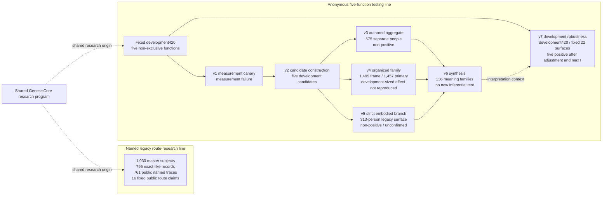

# Study map

## Why this map is necessary

This repository contains two related research lines and several versioned tests. Their populations, hypotheses, and purposes differ. A larger number does not automatically mean a later or stronger test, and the counts must not be added together.

The two lines share a research origin but are not drawn as parent and child datasets. The public repository does not provide a row-level identity mapping between the 1,030-person legacy ledger and development420.

## Research surfaces

| Surface | People / units | Question | Result | Do not infer |
|---|---:|---|---|---|
| Legacy route research | 1,030 master; 795 exact-like; 761 subject traces | Which recurring route families or branches remain in the current public claim surface? | 16 fixed public route claims | Deterministic occupation prediction or independent validation of every route |
| v1 | 12-person measurement canary | Was the proposed real-world outcome measurement ready for an external route test? | `MEASUREMENT_FAILURE`; route test not performed | That the route hypothesis was tested and rejected |
| v2 | development420; 515 rules; five functions | Can five non-exclusive social functions and candidate chart structures be constructed? | Five development candidates; external validation count 0 | Independent confirmation |
| v3 | 575-person separate surface | Does a corrected broad Jyotish authored-production aggregate reproduce? | Non-positive; other four functions underpowered | Null result for every authored family or astrology as a whole |
| v4 | 1,495 frame; 1,457 primary | Does a fixed two-branch Jyotish organized-realization family reproduce a development-sized effect? | Positive point estimate, but confirmation failed; development-sized effect excluded under the declared rule | Exact zero association or rejection of every organized-realization route |
| v5 | 313-person legacy surface | Does one strict Jyotish embodied-competition branch reproduce? | Strict branch non-positive; carrier-free direction unconfirmed | Rejection of embodied competition as a function or all related routes |
| v6 | 136 corrected meaning families; 134 supported in both internal subcohorts | What candidate granularity remains defensible after v3–v5? | Synthesis: finite, meaning-coherent mechanism family proposed as future test unit | New external confirmation or 136 validated routes |
| v7 | fixed development420; 22 surfaces; 18 estimable | Do measured external factors or fixed-family multiplicity explain the five aggregate development associations? | All five remained positive after adjustment and maxT | Person-out replication, causality, or validation of all earlier candidate freedom |

## How to read the chronology

### Legacy route research

The legacy program began from notable people with birth-data records and public biographies. It developed route families and branches, expanded the corpus, and retained 16 routes in a public fixed claim surface. A public subject-level trace provides 761 named records, but the top route is a pressure observation rather than a person's final label.

### Five-function development

The later research changed the outcome design. Instead of asking for one occupational class, it allowed one person to have several documented functions. That change produced five aggregate development associations and a larger candidate universe.

### Person-out stress tests

Versions 3–5 tested three particular candidate formulations on people outside the corresponding development outcome construction. None met its route-specific positive rule. The tests differed in function and granularity, so they cannot be merged into one universal null result.

### Robustness inside development420

Version 7 asked a different question: whether the five aggregate development associations survived measured external-factor adjustment and simultaneous testing across a fixed 22-surface family. They did. This strengthens the description of the development result without turning it into independent replication.

## Recommended reading order

1. [Plain-language Summary](PLAIN_LANGUAGE_SUMMARY.md)
2. [v7 English README](../independent_social_expression_v7/README.md)
3. [v7 Methods](../independent_social_expression_v7/METHODS_EN.md)
4. [v7 Failures and Limits](../independent_social_expression_v7/FAILURES_AND_LIMITS_EN.md)
5. [Reproducibility Boundary](REPRODUCIBILITY_BOUNDARY.md)
6. [English Research Report](../REPORT_EN.md)
7. Version-specific README and result files for v1–v6
